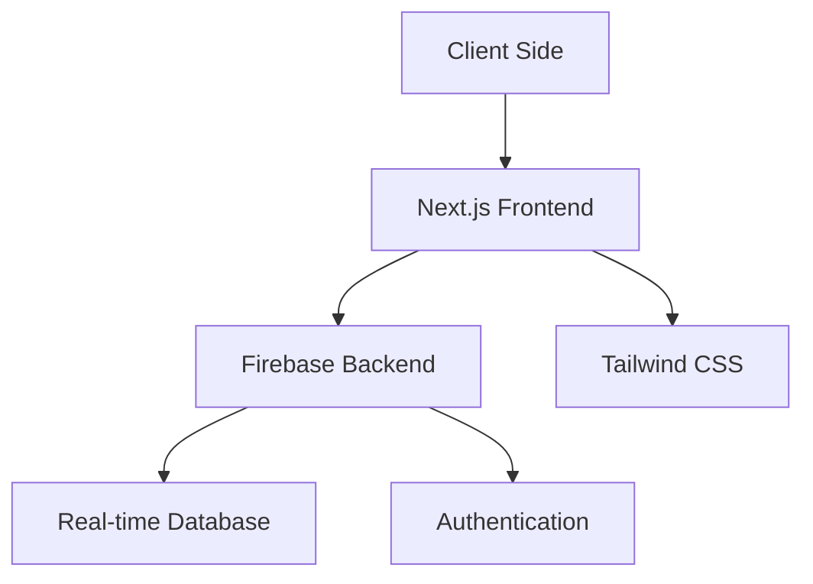

# SustainEarth

<div align="center">

🌍 **Empowering Sustainable Development Through Technology** 🌱

[](https://opensource.org/licenses/MIT)
[](https://nextjs.org/)
[](https://tailwindcss.com/)
[](https://firebase.google.com/)

*Building a better future through sustainable solutions*

</div>

## 🎯 Mission

SustainEarth addresses three critical United Nations Sustainable Development Goals (SDGs):

- 🌾 **No Hunger (SDG 2)**: Reducing food waste and ensuring food security
- 📚 **Quality Education (SDG 4)**: Providing accessible learning opportunities
- 💼 **Decent Work and Economic Growth (SDG 8)**: Fostering sustainable economic activities

## 🚀 Core Features

### 1. FoodHub: Fighting Hunger Together 🍽️

Transform surplus into sustenance through our innovative food redistribution platform.

| Feature | Description |
|---------|------------|
| Share | Post excess food from restaurants or individuals |
| Find | Browse food listings with detailed information |
| Alert | Real-time mapping of food needs via Leaflet & OpenStreetMap |

### 2. Learn&Share: Education for All 📚

A dynamic learning ecosystem connecting students, educators, and professionals.

| Feature | Description |
|---------|------------|
| Learn | Access courses and earn certificates |
| Forums | Engage in knowledge-sharing discussions |
| Articles | Stay informed with curated educational content |

### 3. MarketPlace: Sustainable Commerce 🛒

Promoting circular economy through mindful trading and sharing.

| Feature | Description |
|---------|------------|
| GreenMarket | Buy, sell, rent, or trade sustainable goods |
| SellNRent | Manage listings and trade requests |
| QuickAsk | Community resource sharing platform |

## 💎 Subscription Tiers

| Feature | Free Tier | Premium Tier |
|---------|-----------|--------------|
| Trial Period | 3 days premium access | Unlimited |
| Daily Coin Limit | 250 coins | 350 coins |
| Progress Tracking | 1 friend | Unlimited friends |
| Learn&Share Access | Basic features | Full access |
| Marketplace Features | Standard | Advanced privileges |

## 🪙 SustainEarth Coins System

### Earning Opportunities

```
🎁 Donations
├── ₹250 donated = 25 coins
└── Each meal donated = 12 coins

📚 Learn&Share
├── Forum Posts = 25 coins
├── 100 views = 5 coins
├── 25 likes = 5 coins
└── Class Upload = 25 coins
```

## 📊 User Dashboard Features

- **Real-time Analytics**: Track your sustainability impact
- **Contribution Metrics**: Monitor donations and engagement
- **Social Progress**: Compare achievements with community
- **Achievement System**: Earn badges and rewards

## 🛠️ Technical Architecture



## 🚀 Getting Started

### Prerequisites

- Node.js (v14 or higher)
- npm or yarn
- Firebase account

### Installation

1. **Clone the repository**
   ```bash
   git clone https://github.com/sushanshetty1/sustainearth.git
   cd sustainearth
   ```

2. **Install dependencies**
   ```bash
   npm install
   ```

3. **Configure Firebase**
   ```env
   NEXT_PUBLIC_FIREBASE_API_KEY=your_api_key
   NEXT_PUBLIC_FIREBASE_AUTH_DOMAIN=your_auth_domain
   NEXT_PUBLIC_FIREBASE_PROJECT_ID=your_project_id
   NEXT_PUBLIC_FIREBASE_STORAGE_BUCKET=your_storage_bucket
   NEXT_PUBLIC_FIREBASE_MESSAGING_SENDER_ID=your_sender_id
   NEXT_PUBLIC_FIREBASE_APP_ID=your_app_id
   ```

4. **Run development server**
   ```bash
   npm run dev
   ```

5. **Build for production**
   ```bash
   npm run build
   npm start
   ```

## 🤝 Contributing

We welcome contributions! Please follow these steps:

1. Fork the repository
2. Create a feature branch (`git checkout -b feature/AmazingFeature`)
3. Commit changes (`git commit -m 'Add AmazingFeature'`)
4. Push to branch (`git push origin feature/AmazingFeature`)
5. Open a Pull Request

## 📬 Contact

Sushan Shetty - sushanshetty1470@gmail.com

Project Link: [https://github.com/sushanshetty1/sustainearth](https://github.com/sushanshetty1/sustainearth)

---

<div align="center">

**"Small actions create big changes. Join us in building a sustainable future."**

🌱 SustainEarth - Making Sustainability Accessible to All 🌍

</div>
